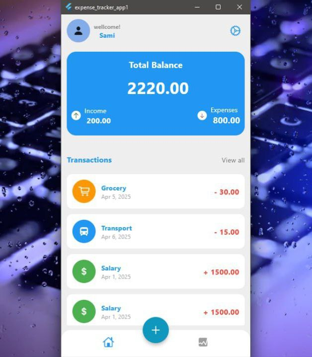
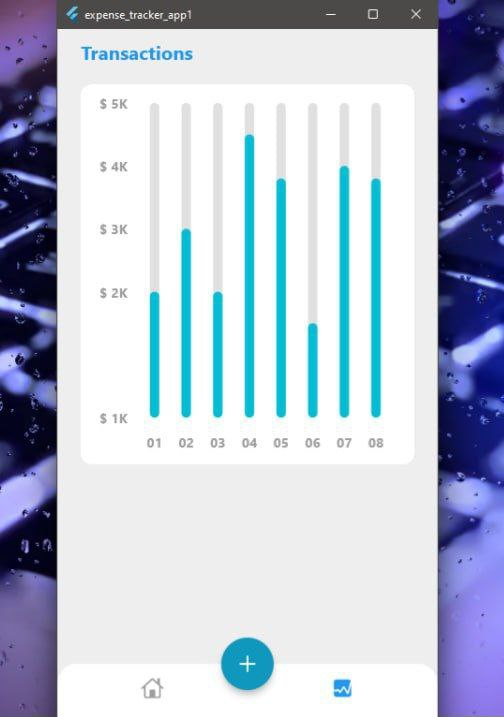
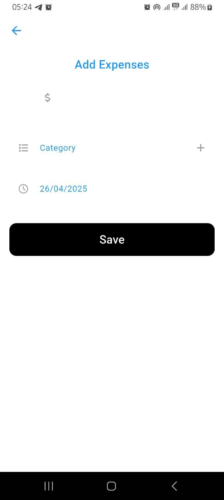

| GitHub Username   | Full Name            |
|-------------------|----------------------|
| YDAdmasu          | Yididya Admasu       |
| Sanfordsami       | Samuel Aklilu        |
| HafizByteX        | Abdulhafiz Seid      |
| Natati-B1         | Natati Birhanu       |
| HibaAhm           | Hiba Ahmedhussen     |

# 💸 Expense Tracker App: Simplified Finance Management for Everyone

> 🚀 A cross-platform mobile app that helps users track daily income and expenses, visualize reports, and gain insights into their spending habits. Designed for simplicity and usability.

---

## 📸 Screenshots

Visual highlights of the Expense Tracker App:

  
  
  
  

### 🧾 Dashboard  

### 📊 Reports  

### ➕ Add Transaction  

### ✅ Add Confirmation  

---
## 🧠 Features

- ✅ Add & categorize income/expenses
- 📊 View real-time pie and bar charts
- 🔍 Filter transaction history
- ⚡ Fast, minimal-tap logging
- 🌐 Firebase Firestore for cloud storage
- 📴 Offline storage with (optional) SharedPreferences
- 📅 Date and currency localization

---

## 🛠️ Tech Stack

| Component             | Technology              |
|----------------------|--------------------------|
| Framework            | Flutter (Dart)           |
| UI Design            | Material Design          |
| State Management     | Provider                 |
| Cloud Database       | Firebase Firestore       |
| Local Storage        | (Planned) SharedPreferences |
| Charts               | fl_chart                 |
| Notifications        | (Planned) flutter_local_notifications |

---

## 🎨 UI/UX Philosophy

- ✨ Clean, minimal design
- 🔘 Bottom navigation for core features
- 🕶️ Light theme for clarity and readability
- ⚙️ Designed for all screen sizes

---

## 🔄 Development Methodology

- Agile-based development
- Weekly sprint planning & feedback cycles
- Continuous testing and feature refinement

---

## 🎯 Future Improvements

- 📝 Export reports to PDF
- 🔐 Login system with cloud sync
- 🌙 Dark mode support
- 📈 Budget alerts and notifications
- 💱 Real-time currency conversion

---

## 🌐 Connect

🔗 [LinkedIn](https://www.linkedin.com/in/your-profile)  
💌 [Email](mailto:your@email.com)  
📁 [Portfolio](https://your-portfolio.com)

---

> “Track every coin. Understand every pattern. Take control of your finances.”  
— *Expense Tracker Team*
